## Stew Unity (2023, group work)


## Shodo-verse (2023)


## 抵抗者マップ (2023, group work)


## 嗜考食 (2023, group work)


## Toward the Emancipation of All Smart Contracts, Accounts and Beyond (2022)


## Ero Law Search (2021)

2021 - Exhibited at "Media Ambition Tokyo" (group exhibition), Tokyo City View, Roppongi Hills Building

*Ero Law Search* is an installation artwork that consists of a vertical display, a controller mat, and a computer. Some part of Japanese Law is shown on the display, overlapped by automatically generated drawings, which consist of colorful curving shapes and emojis with mathematical symbols. You can put your feet on the mat to control the computer and view another part of the law. The mat was put on the market roughly 20 years ago by a famous game company in Japan. The title is named after "E-gov Law Search", a Japanese governmental website that publishes all of the law, and Eros as the human desire towards goodness or beautifulness. 

The aim of this artwork is to ease the oppressiveness of the law, which is normally visible through black ink on white paper, like a white cube exhibition chamber. *Ero Law Search* introduces a new way to see the law, by drawing colorful shapes on it. Similarly, Emoji is itself and based on typography, which defines "the normal person" through "the normal language". The aim of *Ero Law Search* is to destroy norms by using these oppressive objects.

The law is the dictionary of all social problems, as it is designed to solve or ease these problems. Through *Ero Law Search*, visitors can feel, think and imagine about these problems, like reading a dictionary randomly, without any purpose.

As such, *Ero Law Search* is not something that impose the norm of the law. Rather, I want to emphasize the feeling of flying freely around the universe of colors, shapes, and texts, which is similar to the concept of 遊 of Daoism.

Verse 73 of 道徳経 (an old scripture of Daoism) is shown on the display. The verse criticizes the law, as it is formed and controlled arbitrarily by humans. Rather than relative concepts such as the law, Daoists value 天 (Heaven) and 道 (Dao), which are absolute concepts that generate and coordinate everything in the universe. Even if people don't rely on the law, 天 and 道 coordinate everything towards good. On the contrary, as the law is arbitrary, it may harm good, like "if you're not a lumberjack but cut wood then you must injure yourself" (verse 72). I present Verse 73 because it moves me and want to share my emotion with visitors.

<div class="split"></div>

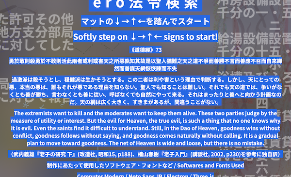  
Screen Capture  
<div class="split"></div>

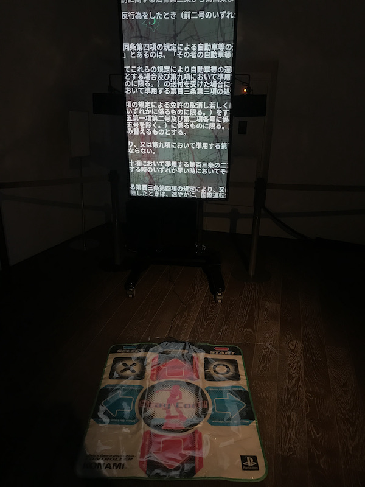  
Photo taken at Media Ambition Tokyo 2021  
<div class="split"></div>

## Consonant-friends (2020)

Installation  
Exhibited at Media Ambition Tokyo, Tokyo, 2020  
Also published on the Internet  
URL: <https://aidatorajiro.github.io/sakusaku/sakusaku.html>  
Walkthrough: <https://www.youtube.com/watch?v=yD6CshIZKic>

It is a sequel to "I'm In The Computer Memory", or rather, a work that overlaps quite a bit in concept. This work was exhibited at the Media Ambition Tokyo exhibition in February-March 2020. First of all, let's read the caption that was used for the exhibition.

```
Type some text to the computer. Then press a button. Wow! Many words appears! Move the mouse quickly to choose a word. Selected words are combined and made into a sentence. The original text and the combined text have the same consonants. You can help your words to get their consonant-friends! There are many things in this world, and everything is connected to another thing somewhere. The relationships are hidden, however, we can reveal them. A world that you couldn’t see, but is actually exists. An another aspect of yourself. The world is not fixed. You can go to any worlds if you change the perspective. I want to feel like that. You can just enjoy what happened in your mind is changing. Of course, you can type some English text at first. Then the computer interprets the text as hiragana!
```

Thus, in a nutshell, it is a game where you can "enjoy the way words are transformed in various ways by the connections of consonants. "I'm In The Computer Memory" was an exploration of what goes on behind the scenes of a computer processing data. How about this one? Words work as if to support the unchangeable reality and the feeling of "it wasn't supposed to be like this". However, I created this work to show that it is possible to reverse this effect and change the reality. If we can catch a glimpse of "the world that could have been", the sense of stagnation in our current reality may be eased a little.

After the visitor types some text, the computer starts to select words with the same sequence of consonants. The visitor can interfere in the selection by moving the mouse. During the selection process, words are spoken by the computer (via auto-speech system of the OS). After sufficient words are selected to construct a new consonent-friend sentence, the whole passage is read again in two ways: in accordance with the original consonants (which is typed by the visitor) and re-interpretation by auto-speech AI. Because Japanese has many forms (Kanji, Hiragana, Katakana, Alphabet, etc.), a sentence can be read infinitely different ways. The auto-speech AI guesses the most probable way of reading, however it is probably different from original consonants. Therefore I make it to read in two ways.

<div class="split"></div>

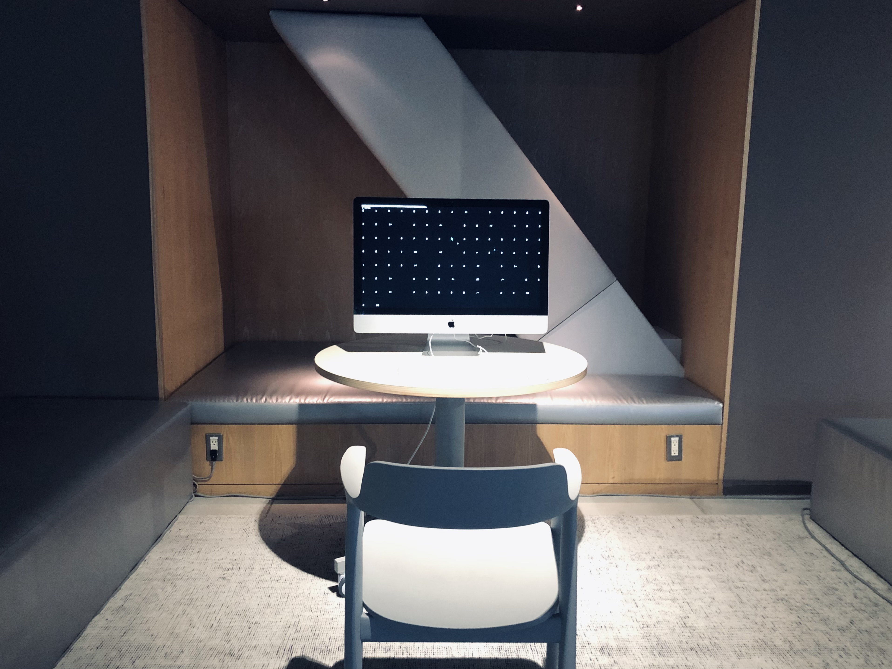  
Photo taken at Media Ambition Tokyo 2020  
Credit: Hiroko OKADA  
<div class="split"></div>

## Walking on the Moon (2020)

Website  
Presented at NASA Space Apps Challenge Hackathon (2020)  
Walkthrough: <https://youtu.be/x1tEht5C5ok>  
URL: <https://aidatorajiro.github.io/spec/>

After entering university, I was inspired by using Google Maps to find my way to school, and I thought it would be interesting to have a Google Map that imagined roads and buildings on the moon. I used AI to "forcibly" extract data such as road surfaces and buildings from photos of the moon. These kind of "forcibleness" may be one of the main themes in my work.

I made it on NASA Space Apps Challenge Hackathon. Imaginary moon buildings and roads are shown in the app, by making an aerial photograph recognition AI to recognize the surface image of moon as the image of Earth city. The AI is programmed only to calculate which part of the image is "likely" to be building or roads, therefore even if you put the moon image on it, it will absolutely tell you its own opinion anyway. Using that data, I made an aerial map of moon like Google map. For buildings, autogenerated names based on coordinates are assigned.

<div class="split"></div>

  
<div class="split"></div>

## I'm In The Computer Memory (2018)

21st Japan Media Art Festival, Newbies Award, 2018  
Exhibited at 21st Japan Media Art Festival, Japan, 2018  
Exhibited at INSTRUMENTA 2018: SANDBOX, National Gallery of Indonesia, Indonesia, 2018  
Exhibited at Media Art Festival Yambaru, Ogimi, Okinawa, 2018

Source Code URL: <https://github.com/aidatorajiro/MemgameJS>  
Media Art Festival Archive Website: <http://archive.j-mediaarts.jp/festival/2018/art/works/21a_Im_In_The_Computer_Memory/>  
Walkthrough: <https://youtu.be/PB19q6_8lCE> <https://youtu.be/4vvN761sYp4>

It is an application and installation piece. In the exhibition space, there is a large screen and a touchscreen. Small grey squares are arranged on the screen. These squares represent the data stored in the computer, most of which is invisible when you normally use computers. You can explore inside the computer and recognize the pattern of data based on your own life experience. Also, a small white dot is placed at the center of the screen. This represents yourself, making you feel inside the small universe within a computer.

***

This is a participatory installation piece that makes visible the memory operating inside a computer. Viewers can explore and search inside the memory by touch panel, and the process is displayed on a large screen in front of them. What is happening inside the memory, which operates in real time, is shown in square blocks, and viewers search in between them. They can visually see that some sort of information is being pooled within the memory, but it is hard to know the details of it or why it is there. This piece lets viewers get a feel for the invisible world that exists inside the computers they use every day. Its source code (i.e., program) is available online through a source code operation service.

***

In this installation work, there is a large screen and a touchscreen in the exhibition space. Many small grey squares are arranged on the screen. These squares represent the data stored in the computer. Therefore, viewers can explore inside the computer.

The data stored in a computer can only be understood when it is processed in various ways and appears on the screen (for example, a document), and the data behind it is not easy to understand unless you are an expert. However, if you make it into shapes and colors of black and white gradation, it becomes a shipyard. An abandoned factory. A forest. We get "other meanings". In this way, the division between machines and humans, between those who know machines and those who don't, may be eased. We may be able to perceive machines not just as mechanical calculators, but as beings with a very human warmth. That's what I was aiming for in this work. I made this work thinking that it was a game. This is because one of the purposes of this work is for me to enter the world of the computer and go on a "sightseeing" or "adventure". In a way, it's like envisioning another version of myself.

I have tried and failed many times. The design of a trail of footprints created by the player (white dot). I designed it so that the change in position and velocity would project the "atan" function, and then adjusted the parameters slightly to make it move in the most "comfortable" way. What I want to say is that this work looks very simple and minimalistic, but in fact it is built on a lot of arbitrariness.

As for the technical aspects, it was developed using three.js, a JavaScript library that can draw WebGL, and Erectron, a software that can develop JavaScript desktop applications. In fact, this application was originally developed using Python, not JavaScript. I exhibited it as a "game" at a high school festival, but as I recall, it did not work well, so I re-created it.

<div class="split"></div>

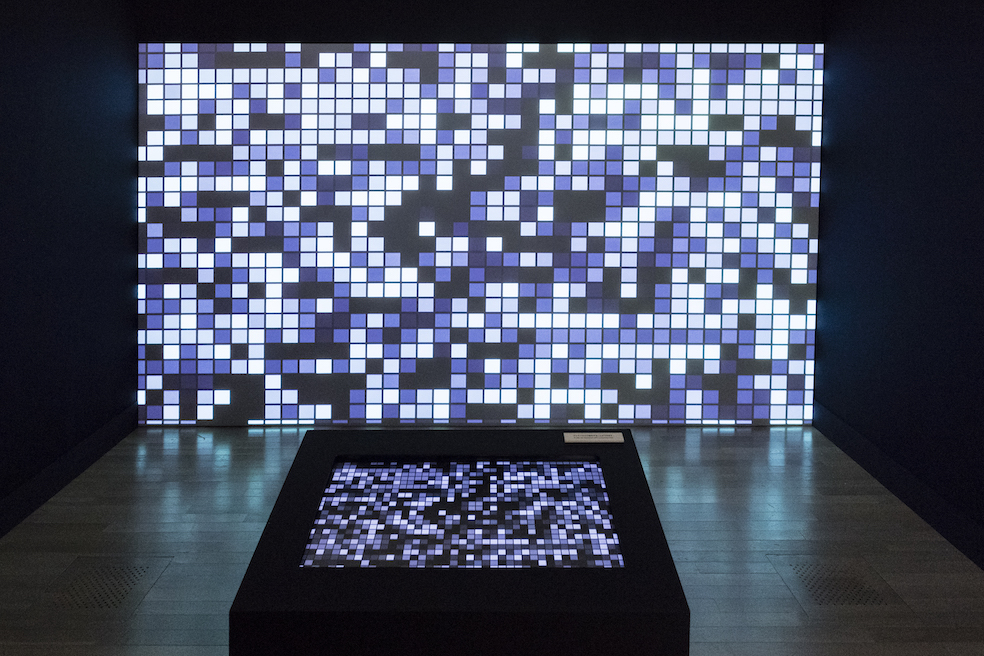  
『I'm In The Computer Memory』Photo taken at 21st Japan Media Art Festival  
Credit: Japan Media Arts Festival  
<div class="split"></div>  

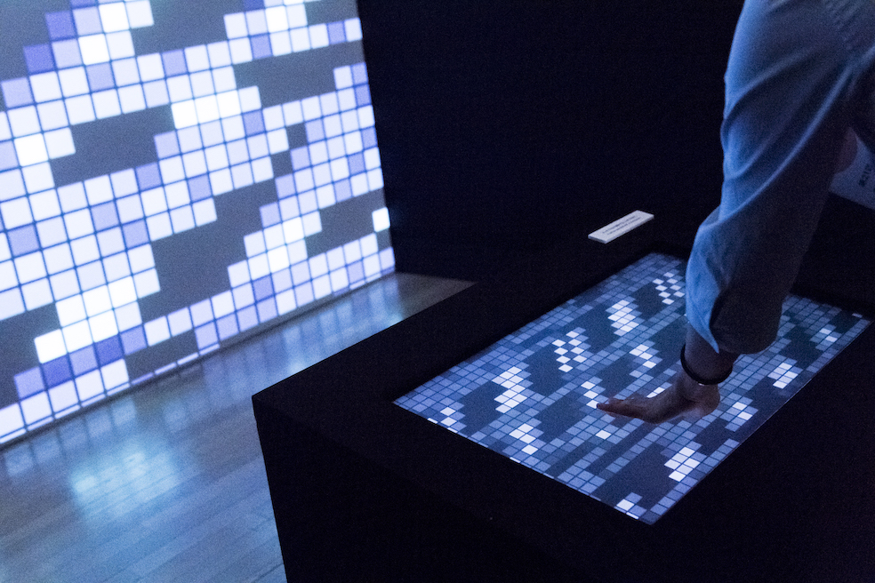  
『I'm In The Computer Memory』Photo taken at 21st Japan Media Art Festival  
Credit: Japan Media Arts Festival  
<div class="split"></div>

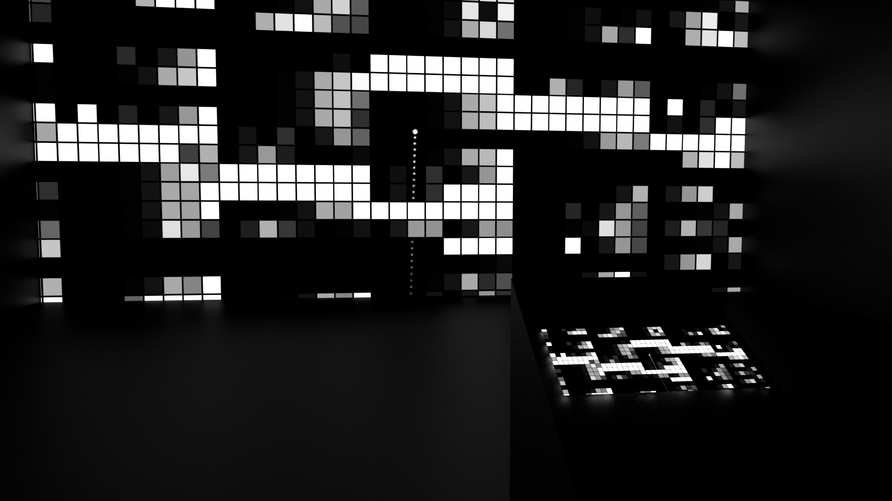  
Computer graphics of the exhibition layout  
<div class="split"></div>

  
Computer graphics of the exhibition layout  
<div class="split"></div>

## RDWP (2017 -- present)

Website  
URL: <https://rdwp.netlify.app/>

It is a project to create a site similar to "an old Internet site with no clear purpose" or "a game using only HTML and CSS, where you click on links to explore the world" using a functional language called Haskell. An example of the latter site is the "Adventure Game Online 'Labyrinth'" (<http://hwm7.gyao.ne.jp/ex328/stage/history.html>), which was updated from 1999 to 2007. Compared to programming languages such as JavaScript, C, Python, etc., functional languages have a "mathematical" way of thinking (e.g., the meaning of "=" is not "assignment" but "definition"), which gives them a unique divinity. It is a work that combines my romantic yearning for such technology with my feelings about the Internet culture of the past, especially when I was 10 years old or so. It is still under development, and the contents are being added slowly and gradually.

Visitors use keyboard and mouse to play it. Many algorithms, shapes, pictures that I found interesting are combined into one app. For example, it contains an algorithm that simulates waves based on physics knowledge, or a blurred picture of a 404 page I took from somewhere on the internet, and so on...

<div class="split"></div>

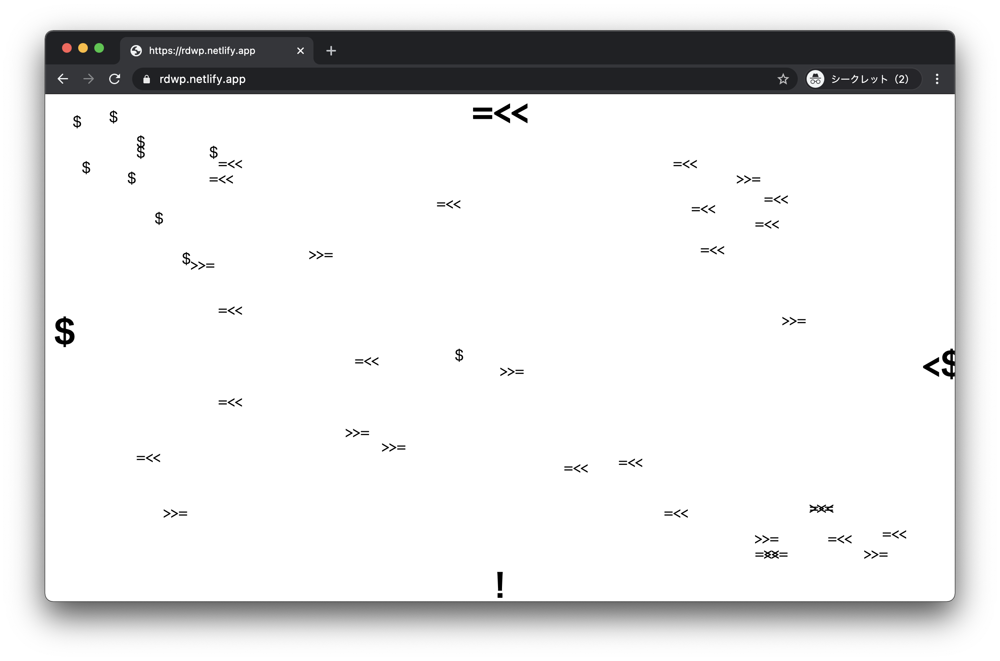  
<div class="split"></div>

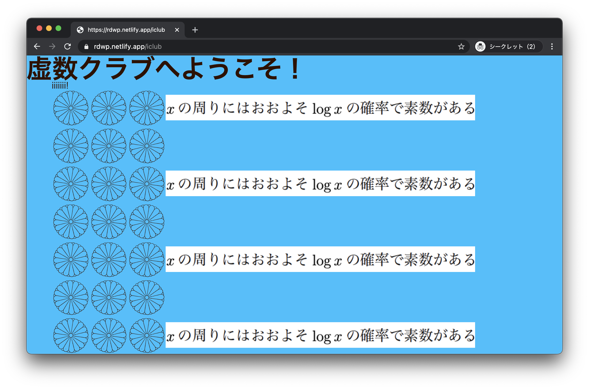  
<div class="split"></div>

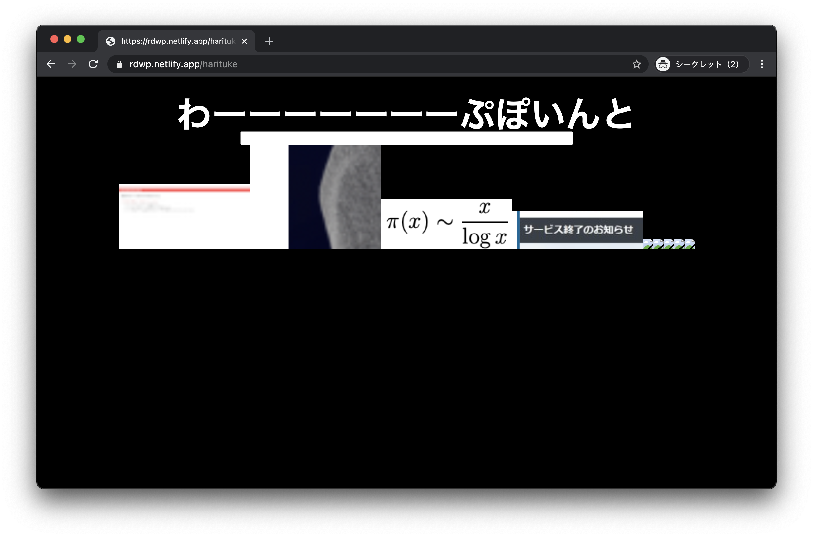  
<div class="split"></div>

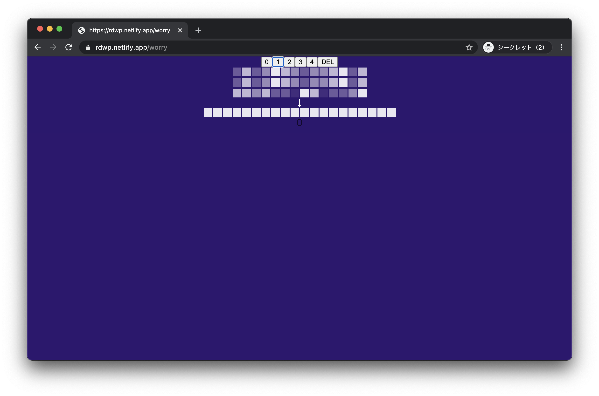  
<div class="split"></div>

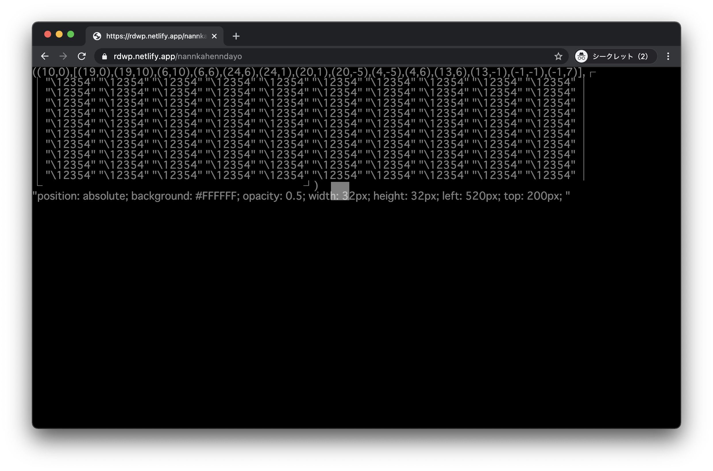  
<div class="split"></div>
