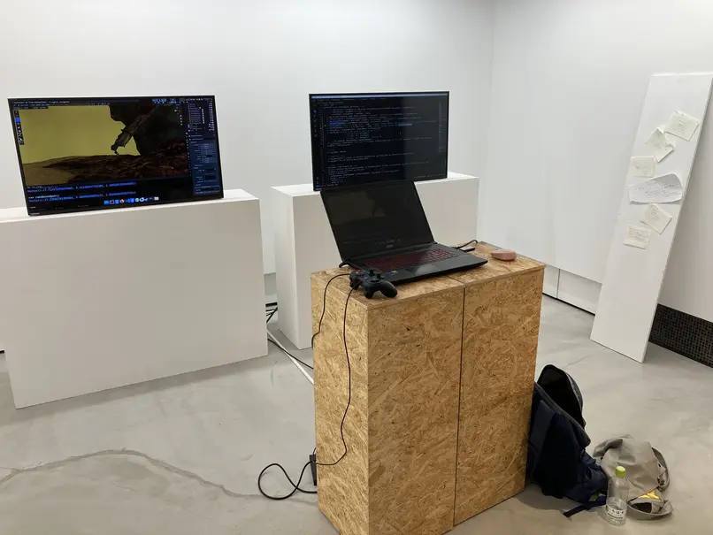
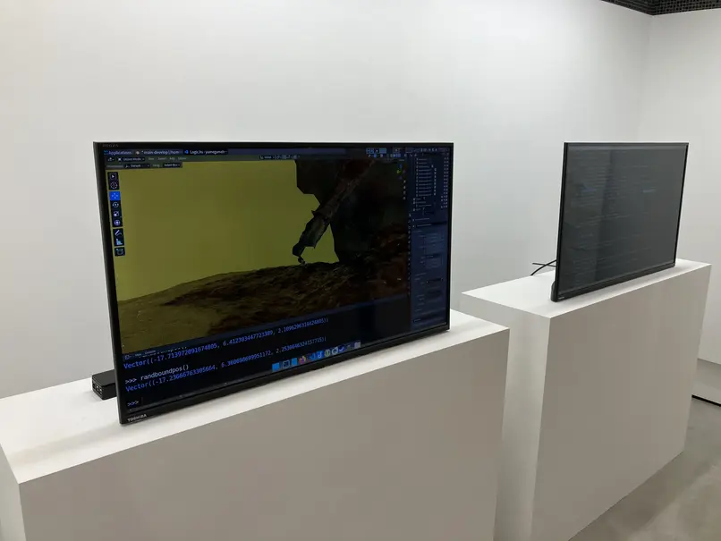
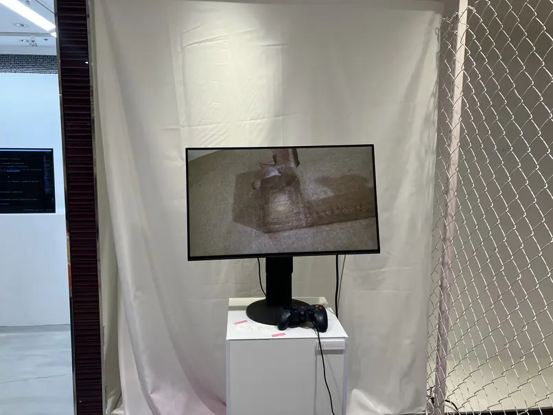
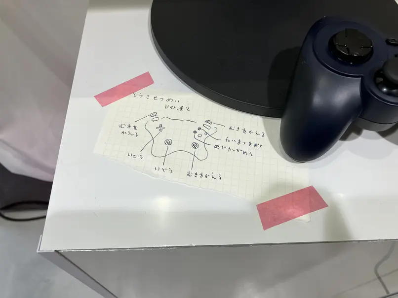
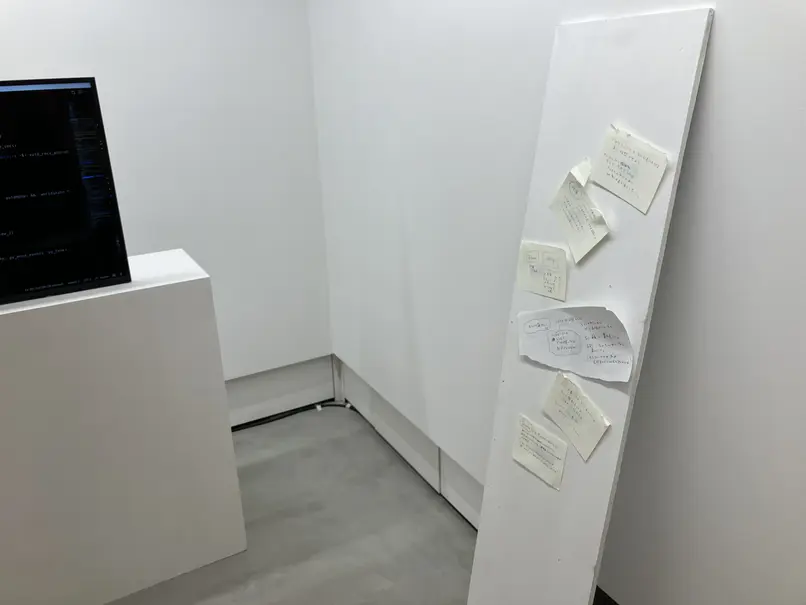

<section>

## yume tensei (2024)

Installation

2024 - the solo exhibition "yume tensei", Uenoshita Studio, Tokyo

I was dreaming. I was an ant-sized creature. Walking in the darkness. I saw tatami, random rusty things, toys, glowing tree, some sort of farm, creatures chasing me. I had several sandbox-game-like experience, such as growing crops, solving puzzles to explore further. In this exhibition, sometimes recalling the dream, I explore how to simultaneously develop and play a game, by modifying a famous computer graphics software Blender. The virtual space will contain 3d-scanned rubbish, broken things, abandoned materials at ABAB. How dream, me, and these objects tensei (reincarnate)?

Deeply related to my graduation research at university, I have been thinking recently about whether tools such as Photoshop, Illustrator, or programming languages themselves could provide a kind of “game” experience. Rather than tools simply providing functions for the purpose of creating 3D models or processing photos, I wonder if it would be possible to have a simulated life experience within the tool, or if improving and developing the tool itself could be like playing with clay or building blocks. Using what is already there, while remaking what is already there (“reinventing the wheel”), while creating something new. Modifying/hacking existing software Blender, with the aesthetics of Haskell and Yampa, a somewhat-minor programming language that can be transformed like clay.

Only a very small amount of data could be captured during the live performance period, and the programming ended up with only a basic implementation. We would like to develop this project in the future.

</section>

## Stew Unity (2023, group work)

Group work with [Ogi Kumiko](https://k-ogi1.wixsite.com/website), [sawako](https://troncolon.com/), [TAMAFREEDOM](https://twitter.com/TAMA_FREEDOM369), [teshnakamura](https://teshnakamura.com/)

2022 - Exhibited at "Future Ideations Camp Vol.2 | setup(): Making New Rules with Blockchains", CCBT, Tokyo, Japan.

Github repo: <https://github.com/aidatorajiro/rakugaki>  
Testnet Opensea: <https://testnets.opensea.io/0xae97EDa493939137B20aD1E45Dd14cD82B2f3826>  
NFT generation service: <https://rakugaki.aidatorajiro.dev/>

We designed a flexible and extensible smart contract program to create the NFT to scribbling against bills. Here, we divided the smart contract into multiple components to allow the use of various image data, NFT mechanisms, and SVG effect programs. We imagine that "blockchained scribbling tied to physical (or digital) bills" and "bill glitches" will be a tradition of blockchain culture in the future. By making bills astray and ownerless, we aim to free bills from the control of the state and furthermore breathes life into something, or anything, as mundane as a bill.

Due to the technical limitations of full on-chain NFT, only low-resolution images can be uploaded to the network. On the other hand, SVG, which describes visual entity as a mathematical formula, allows for unlimited resolution. By combining "ultra-low-resolution images" and "SVG with infinite resolution," we are trying to deconstruct the situation surrounding computers and data, in which the superiority is determined by the computing power of hardware and the efficiency of algorithms, competition is accelerating, and resources are being wasted more and more. It can be said that we seek a different approach to blockchain technology, which tends to be criticized as a "waste of computing resources.

  
Screenshot of generated NFTs  

  
Screenshot of NFT generation service Web app

</section>

<section>

## Shodo-verse (2023)

2023 - Exhibited at "Hakkou Hajimarimashita (発酵、はじまりました)", Waseda University, Tokyo, Japan

In collaboration with/using text generation AI, various social issues will be "compressed" into flow of kanjis, written in ink on hanshi (半紙) paper, and annotations will be added. The art of chain of impressions through kanji, is similar to that of rap. Is this the possibility of solidarity that transcends positions, or will it become a tool of Shinzo Abe or Fumio Kishida's deception for techno-feudalism? I would also like to explore ways to become a cyborg by recognizing the fundamental disconnection with machines, and delusions that are not captured in a larger story.

In the university, I took a course on the comparison of rap cultures in Japan and France. There, I learned about the relationship between political slogans at the demonstration and rap as a form of expression. This experience of learning inspires the work.

I used ChatGPT and LLaMA-based Stable Vicuna language models to generate texts from prompt. Firstly, I collected various social issues from such as the Japanese debt system, the problem that LGBTQ+ people faces when renting houses, from the news. The language model also provided social issues. Nextly, I wrote the "compressed" version of these issues using only kanjis, and passed them to the language model. The language model generates remaining texts, generating non-existent words such as "法圧" (法 usually means the law, and 圧 usually means the pressure). Lastly, I wrote down the inputs to AI and the output from AI into the Shodo paper sheet (hanshi), along with the annotations on how these passages are calculated. The annotations show that the data-collection and data-generation process is non-linear, combining my own knowledge and imagination and AI generation back and forth.

I hope this work contributes to the conversations on the relationship between generative AI, politics and poetics.

</section>

<section>

## Toward the Emancipation of All Smart Contracts, Accounts and Beyond (2022)

2022 - Deployed at Polygon network  
2022 - Exhibited physically at "Meta Fair #1", Yurakucho, Tokyo, Japan.

*Toward the Emancipation of All Smart Contracts, Accounts and Beyond* is an artwork consists of a smart contract code on the Polygon blockchain network and a pdf document, disguised as a "whitepaper", a tradition in the blockchain and crypto community to present an idea and gather fund. The pdf document portrays the detail of the contract system and the aspirations toward the artificial deity which is prayed via blockchain, to emancipate us.

The smart contract program uploaded to the blockchain network gathers prays from the participants, who are owners of NFTs associated with the contract. Then, the program calculates a random address based on the prays and send the information to the address. This process involves "call" function defined by Ethereum specification, which is usually used to run a smart contract, however in this case it is believed to be a path to "call" upon deity.

</section>

<section>

## Ero Law Search (2021)

2021 - Exhibited at "Media Ambition Tokyo" (group exhibition), Tokyo City View, Roppongi Hills Building, Tokyo, Japan  
Walkthrough Video: <https://www.youtube.com/watch?v=VRpPflo5ErQ>

*Ero Law Search* is an installation artwork that consists of a vertical display, a controller mat, and a computer. On the display, Japanese Law is shown, decorated with automatically generated colorful combinations of drawings, curving shapes, emojis and mathematical symbols. You can put your feet on the mat to control the computer and view another part of the law. The mat is a consumer product that was sold 20 years ago by a game company in Japan. The title is named after "E-gov Law Search", a Japanese governmental website that publishes law, and Eros as the human desire towards goodness or beauty.

The aim of this artwork is to ease the oppressiveness of the law, which is normally visible through black ink on white paper, akin to a "white cube" exhibition chamber. *Ero Law Search* introduces a new way to see the law, by drawing colorful shapes on it. The aim of *Ero Law Search* is to destroy norms by using these oppressive objects.

The reason why I used emojis is that they have an interesting duality. They are based on typography, which confines textual expression by certain norms, estranging complex emotions. However, they also have the power to blur and deconstruct meaning of words.

The law is the dictionary of social problems, as it is "designed" to "address" these problems. Through *Ero Law Search*, visitors can feel, think and imagine about these problems, like reading a dictionary randomly, without any purpose. In fact, while playing the artwork, I was very surprised to see the most of the texts of law were still dreadfully patriarchal.

As such, *Ero Law Search* is not something that impose the norm of the law. Rather, I want to emphasize the feeling of flying freely around the universe of colors, shapes, and texts, which is similar to the concept of 遊 of Daoism.

  
Screen Capture  

  
Photo taken at Media Ambition Tokyo 2021  

</section>

<section>

## Consonant-friends (2020)

Installation  
Exhibited at Media Ambition Tokyo, Tokyo, 2020  
Also published on the Internet  
URL: <https://aidatorajiro.github.io/sakusaku/sakusaku.html>  
Walkthrough: <https://www.youtube.com/watch?v=yD6CshIZKic>

It is a game where you can enjoy the way words are transformed depending on the connections of consonants. The system is inspired by Hebrew and Arabic language, in which words may be written only by consonants.

Words work as if to support the unchangeable reality. I created this work to show that it is possible to reverse this effect and change the reality through transforming words and realizing hidden networks behind them. If we can catch a glimpse of "the world (or words) that could have been", the sense of stagnation in our current reality may be eased a little.

To be more specific, after the visitor types some text, the computer starts to select words with the same sequence of consonants. The visitor can interfere in the selection by moving the mouse. During the selection process, words are spoken by the computer (via auto-speech system of the OS). After sufficient words are selected to construct a new consonant-friend sentence, the whole passage is read again in two ways: in accordance with the original consonants (which is typed by the visitor) and re-interpretation of generated text by auto-speech AI. Because Japanese has many forms (Kanji, Hiragana, Katakana, Alphabet, etc.), a sentence can be read infinitely different ways. The auto-speech AI guesses the most probable way of reading (although sometimes they speak in "wrong way"), however it may not include original consonants. Therefore I make it to read in two ways.

  
Photo taken at Media Ambition Tokyo 2020  
Credit: Hiroko OKADA  

</section>

<section>

## Walking on the Moon (2020)

Website  
Presented at NASA Space Apps Challenge Hackathon (2020)  
Walkthrough: <https://youtu.be/x1tEht5C5ok>  
URL: <https://aidatorajiro.github.io/spec/>

Inspired from the experience of using Google Map to find my way to school shortly after entering the university, I made a Google Map-like website that imagines roads and buildings on the moon.

I used AI to "forcibly" extract data such as road surfaces and buildings from photos of the moon. Imaginary moon buildings and roads are shown in the app, by making an aerial photograph recognition AI to recognize the surface image of moon as the image of Earth city. The AI is programmed only to calculate which part of the image is "likely" to be building or roads, therefore even if you put the moon image on it, it will tell you its own opinion anyway. Using that data, I made a Google Map-like application in which you can find shortest path from one place to another. For buildings, autogenerated names based on coordinates are assigned.

This work is made during NASA Space Apps Challenge Hackathon. 

</section>

<section>

## I'm In The Computer Memory! (2018)

21st Japan Media Art Festival, Newbies Award, 2018  
Exhibited at 21st Japan Media Art Festival, Japan, 2018  
Exhibited at INSTRUMENTA 2018: SANDBOX, National Gallery of Indonesia, Indonesia, 2018  
Exhibited at Media Art Festival Yambaru, Ogimi, Okinawa, 2018

Source Code URL: <https://github.com/aidatorajiro/MemgameJS>  
Media Art Festival Archive Website: <https://j-mediaarts.jp/en/award/single/im-in-the-computer-memory/>  
Walkthrough: <https://youtu.be/PB19q6_8lCE> <https://youtu.be/4vvN761sYp4>

It is an application and installation work. In the exhibition space, there is a large screen and a touchscreen. Small grey squares are arranged on the screen. These squares represent the data stored in the computer, most of which is invisible when you normally use computers. A small white dot is placed at the center of the screen. This represents yourself, making you feel inside the small universe within a computer.

Through exploring the inner space of a computer, you may link the gray-scale pattern of data with your own life experience. Although the data behind the scene is not easy to "properly" understand unless you are an expert, with these data transformed into shapes and colors, it may become a shipyard, an abandoned factory, or a forest. We may obtain "other meanings", or "improper way of understanding". In this way, the division between machines and humans, between those who know machines and those who don't, may be eased. We may be able to perceive machines not just as mechanical calculators, but as beings with a very human warmth. That's what I was aiming for in this work. I made this work thinking that it was a game. This is because one of the purposes of this work is for me to enter the world of the computer and go on a "sightseeing" or "adventure". In a way, it's like envisioning another version of myself.

You may see this work looks very simple and minimalistic, but in reality I have tried and failed many times, and it is built on a lot of arbitrariness. For example, I designed a trail of footprints created by the player (white dot), so that the change in position and velocity would project the "atan" function, and then adjusted the parameters slightly to make it move in the most "comfortable" way.

As for the technical aspects, it was developed using three.js, a JavaScript library that can draw WebGL, and Erectron, a software that can develop JavaScript desktop applications. In fact, this application was originally developed using Python, not JavaScript. I exhibited it as a "game" at an art festival during my high school days, but it did not work well, so I re-created it using JavaScript.

  
Photo taken at 21st Japan Media Art Festival  
Credit: Japan Media Arts Festival  
  

  
Photo taken at 21st Japan Media Art Festival  
Credit: Japan Media Arts Festival  

  
Computer graphics of the exhibition layout

  
Computer graphics of the exhibition layout

</section>

<section>

## RDWP (2017 -- present)

Website  
URL: <https://rdwp.netlify.app/>

It is a project to create a website similar to "an old Internet website with no clear purpose" or "a game using only HTML and CSS, where you click on links to explore the world" using a functional language, Haskell. An example of such website is the "Adventure Game Online 'Labyrinth'" (<http://hwm7.gyao.ne.jp/ex328/stage/history.html>), which was updated from 1999 to 2007. 

Compared to programming languages such as JavaScript, C, Python, etc., functional languages have a "mathematical" way of thinking (e.g., the meaning of "=" is not "assignment" but "definition"), which gives them a unique divinity. It is a work that combines my romantic yearning of Functional Programming technology and the Internet culture of the past, especially when I was 10 years old or so. It is still under development, and the contents are being added slowly and gradually.

Visitors use keyboard and mouse to play it. Many algorithms, shapes, pictures that I found interesting are combined into one app. For example, it contains an algorithm that simulates waves based on physics knowledge, or a blurred picture of a 404 page I took from somewhere on the internet, and so on...

  

  

  

  

  

</section>