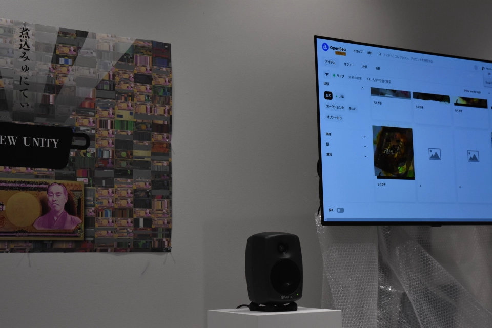
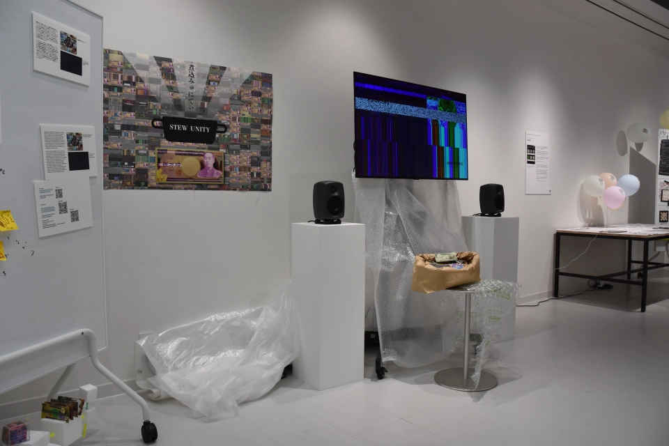
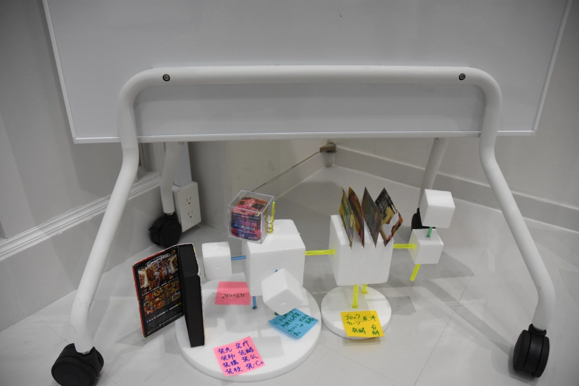
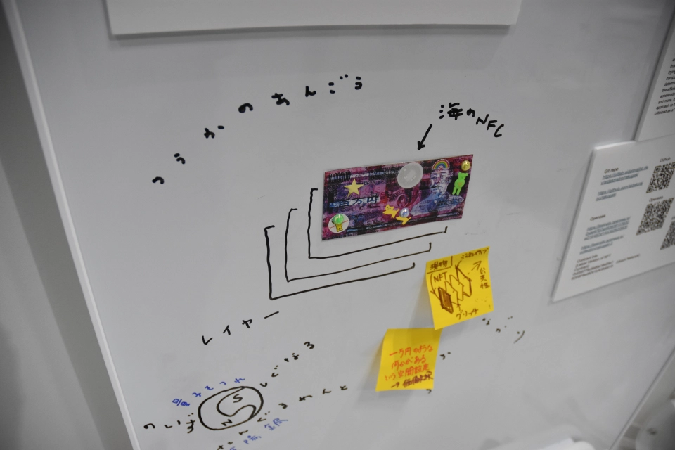
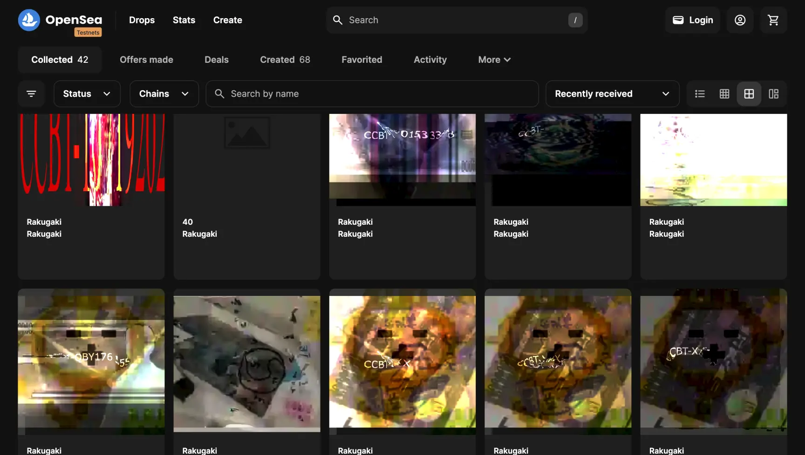
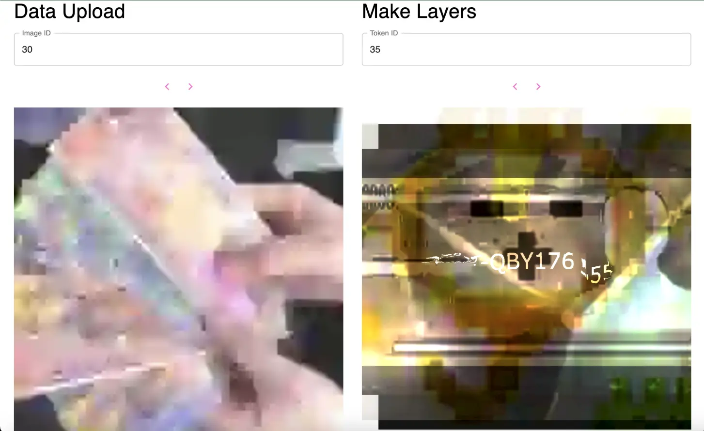
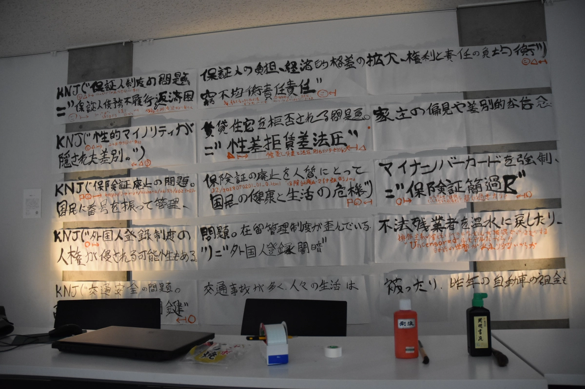
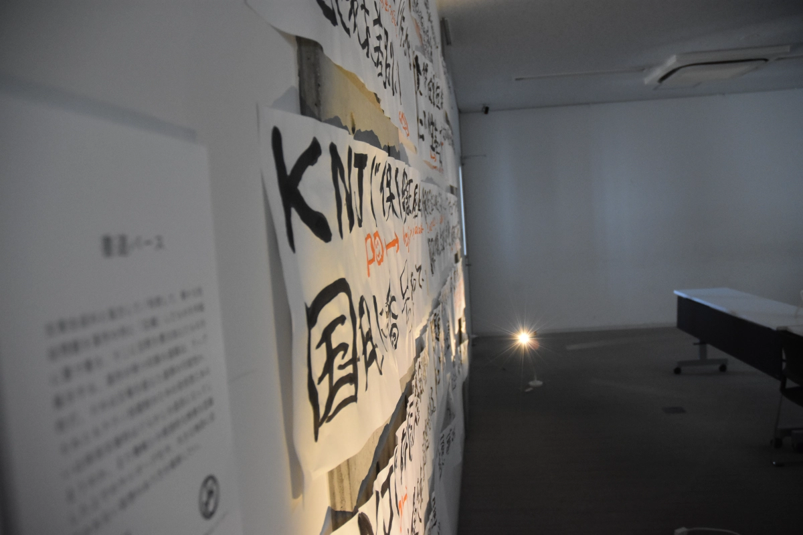
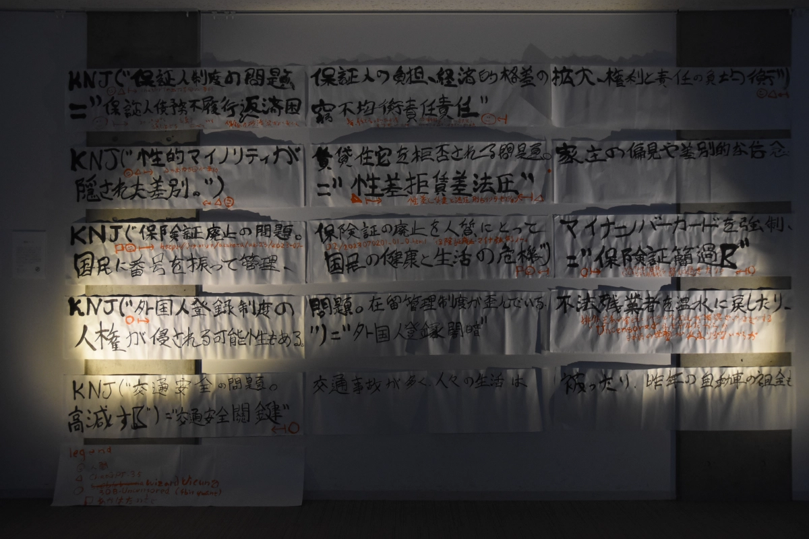
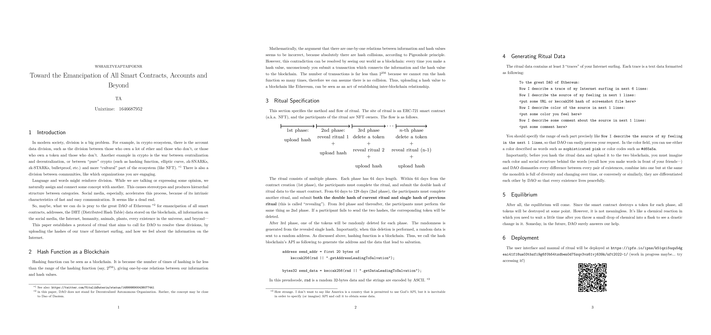

<section>

## 煮込みゅにてぃ (2023, group work)

ネットアート・インスタレーション

[Ogi Kumiko](https://k-ogi1.wixsite.com/website), [sawako](https://troncolon.com/), [TAMAFREEDOM](https://twitter.com/TAMA_FREEDOM369), [teshnakamura](https://teshnakamura.com/) とのグループ制作。  
2022 - 東京 CCBTでのイベント「Future Ideations Camp Vol.2｜setup()：ブロックチェーンで新しいルールをつくる」にて展示。

Github レポジトリ: <https://github.com/aidatorajiro/rakugaki>  
Testnet OpenseaでのNFTデータ公開: <https://testnets.opensea.io/0xae97EDa493939137B20aD1E45Dd14cD82B2f3826>  
NFT 生成用のWebサイト(なお、アクセスにはTestnetに接続されたMatamaskが必要): <https://rakugaki.aidatorajiro.dev/>

落書きNFTの制作にあたって、柔軟で拡張性の高いスマートコントラクトプログラムを設計した。ここでは、スマートコントラクトを複数のコンポーネントに分けることで、様々な画像データやNFTの仕組み、そしてSVGのエフェクトプログラムを利用できるようにした。今後、「お札と結び付けられた落書き」や、「お札のグリッチ」がブロックチェーン文化の一つとして持続していくことを想像している。お札を「野良」化することで、お札を国家による支配から解き放たせ、さらにはお札というありふれたものに命を吹き込む実践といえよう。

フルオンチェーンNFTという技術的制約から、ネットワークには低解像度の画像しかアップロードできない。一方、その画像データを加工するSVGは数式的記述であるため、無限の解像度を得ることができる。「超低解像度の画像」と「無限の解像度を持つSVG」を併用することで、ハードウェアの計算能力やアルゴリズムの効率性によって優劣が決まり、競争が加速し、資源がますます浪費されるという、コンピューターやデータを巡る状況の脱構築を図っている。「計算資源の浪費」という批判も根強いブロックチェーン技術の、そうではないあり方を模索している、とも言える。

  
生成されたNFTのスクリーンショット

  
NFT生成サービスのスクリーンショット

</section>

<section>

## 書道バース (2023)

インスタレーション

2023 - 東京、早稲田大学内 「発酵、はじまりました」展にて展示

テキスト生成AIとのコラボレーション／活用により、さまざまな社会問題を漢字の流れに「圧縮」し、半紙に墨で書き、注釈を加える。漢字による印象の連鎖は、ラップにも似ている。これは立場を超えた連帯の可能性なのか、それとも安倍晋三や岸田文雄のテクノ封建主義への欺瞞の道具になるのか。また、機械との根本的な断絶や、大きな物語にとらわれない妄想を認識することで、サイボーグになる方法を探ってみたい。

大学では、日本とフランスのラップ文化の比較についての講義を受けた。そこで、デモでの政治的スローガンと表現としてのラップの関係について学びました。この学びの経験が、作品にインスピレーションを与えている。

ChatGPTとLLaMAベースのStable Vicuna言語モデルを使い、プロンプトからテキストを生成した。まず、日本の借金制度やLGBTQ+が家を借りるときに直面する問題など、様々な社会問題をニュースから収集した。同時に、言語モデルもまた社会問題を提供してくれた。次に、これらの社会問題を漢字だけで構成された文字の「流れ」によって「圧縮」したものを作成し、言語モデルに渡した。言語モデルは残りのテキストを生成し、「法圧」のような存在しない単語を生成した。最後に、AIへの入力とAIからの出力を、これらの文章がどのように計算されてきたかの注釈とともに、書道用紙（はんし）に筆を用いて書き留めた。注釈は、データ収集とデータ生成のプロセスが、私自身の知識や想像力と、AIの生成を組み合わせてなされた、非線形なプロセスの中で生まれたことを示している。

この作品が、ジェネレーティブAI、政治、詩学の関係についての議論に貢献することを願っている。

</section>

<section>

## Toward the Emancipation of All Smart Contracts, Accounts and Beyond (2022)

ネットアート・インスタレーション

2022 - Polygonネットワークにインストール  
2022 - 東京、有楽町 「Meta Fair #1」での展示

『Toward the Emancipation of All Smart Contracts, Accounts and Beyond』は、ポリゴン・ブロックチェーン・ネットワーク上のスマートコントラクトのコードと、ブロックチェーンや暗号コミュニティでアイデアを提示し資金を集めるための伝統である「ホワイトペーパー」を装ったpdf文書からなるアート作品である。pdf文書には、契約システムの詳細と、ブロックチェーンを介して私たちを解放するために祈られる人工神への願望が描かれている。

ブロックチェーンネットワークにアップロードされたスマートコントラクトプログラムは、コントラクトに関連するNFTの所有者である参加者から祈りを集める。その後、プログラムは祈りに基づいてランダムなアドレスを計算し、そのアドレスに情報を送信する。このプロセスにはイーサリアムの仕様で定義された「call」関数が関与している。「call」関数は、通常はスマートコントラクトを実行するために使用されるが、この場合は神に「call」（呼びかけ）するための道であると考えられている。

</section>

<section>

## Ero法令検索 (2021)

インスタレーション

2021 - 東京 六本木ヒルズ グループ展「Media Ambition Tokyo」での展示  
実際に遊んでいる場面のビデオ: <https://www.youtube.com/watch?v=VRpPflo5ErQ>

『Ero法令検索』は、縦長のディスプレイ、コントローラーマット、コンピューターからなるインスタレーション作品である。ディスプレイには、自動生成されたカラフルなドローイング、曲線図形、絵文字、数学記号の組み合わせで装飾された日本の法律が表示される。マットの上に足を置くと、コンピュータを操作して法律の別の部分を見ることができる。このマットは、2000年代初頭に日本のゲーム会社から発売されたコンシューマー製品である。タイトルは、法律を公開している日本の政府サイト「E-gov法令検索」と、善や美に対する人間の欲望である「エロス」から名付けられた。

この作品の目的は、通常は白い紙に黒いインクで描かれるであろう、「ホワイトキューブ」のような法律の圧迫感を和らげることである。『Ero法令検索』は、カラフルな図形を描くことで、法律の新しい見方を提案する。『Ero法令検索』の目的は、この抑圧的なオブジェを使って規範を破壊することである。

私が絵文字を使った理由は、絵文字には興味深い二面性があるからだ。絵文字はタイポグラフィに基づくもので、文字表現を特定の規範によって制限し、複雑な感情を遠ざけてしまう。しかし、絵文字には言葉の意味をぼかし、分解する力もある。

法律は、社会問題を「解決」するために「設計」された、社会問題の辞書である。『Ero法令検索』を通じて、訪問者は、何の目的もなくランダムに辞書を読むように、これらの問題について感じ、考え、想像することができる。実際、作品をプレイしながら、法律のテキストのほとんどが、いまだに恐ろしく家父長制的であることにとても驚いた。

このように、『Ero法令検索』は法の規範を押し付けるものではない。むしろ、色や形や文字の宇宙を自由に飛び回る感覚を大事にしたい。

  
スクリーンキャプチャー  

  
Media Ambition Tokyo 2021 での展示風景 

</section>

<section>

## 子音ふれんず (2020)

ネットアート・インスタレーション

東京、渋谷「Media Ambition Tokyo, Tokyo, 2020」にて展示  
インターネットでも公開中  
URL: <https://aidatorajiro.github.io/sakusaku/sakusaku.html>  
実際に遊んでいる場面: <https://www.youtube.com/watch?v=yD6CshIZKic>

子音のつながりによって言葉が変化していく様子を楽しむゲーム。子音だけで単語を表記できるヘブライ語やアラビア語にヒントを得た。

言葉は、変えられない現実を支えるかのように働いている。言葉を変容させ、その背後に隠されたネットワークに気づくことで、この作用を逆転させ、現実を変えることが可能であることを示すために、この作品を制作した。あり得たかもしれない世界（言葉）」を垣間見ることができれば、今の現実の閉塞感が少しは和らぐかもしれない。

具体的には、訪問者がテキストを入力すると、コンピューターは同じ子音列を持つ単語を選択し始める。訪問者はマウスを動かすことによって、その選択に干渉することができる。選択プロセス中、単語はコンピュータによって（OSに搭載されている自動音声システムによって）発話される。新しい文章を構成するのに十分な単語が選択された後、文章全体は、元の子音（訪問者が入力したもの）に従って読み上げられる場合と、自動音声AIによって生成された文章を再解釈する場合の2つの方法で読み上げられる。日本語には、漢字、ひらがな、カタカナ、アルファベットなど、さまざまな読み方がある。自動読み上げAIは、最も可能性の高い読み方を推測するが（時には「間違った読み方」をすることもある）、最初に選択された子音が含まれていないこともある。そこで、2通りの読み方ができるようにした。

  
「Media Ambition Tokyo 2020」での展示風景  
フォトクレジット: Hiroko OKADA

</section>

<section>

## 月面通学路 (2020)

ネットアート  
NASA Space Apps Challenge Hackathon (2020)　で制作・発表  
実際に動かしている場面: <https://youtu.be/x1tEht5C5ok>  
URL(現在修理中): <https://aidatorajiro.github.io/spec/>

大学に入学して間もなく、自転車による通学路を探すためにグーグルマップや国土地理院の等高線データを使った経験からヒントを得て、月面の道路や建物をイメージしたグーグルマップのようなウェブサイトを作った。

AIを使って、月の写真から路面や建物などのデータを「強制的に」抽出した。航空写真認識AIに月の表面画像を地球の都市画像として認識させることで、架空の月の建物や道路をアプリ内に表示する。このAIは、画像のどの部分が建物や道路である可能性が高いかだけを計算するようにプログラムされているため、月の画像を載せても、とりあえず自分の意見を言ってくれる。そのデータを使って、ある場所から別の場所への最短経路を検索できるグーグルマップのようなアプリケーションを作った。建物については、座標に基づいて自動生成された名前が割り当てられている。

  
ウェブサイトのスクリーンショット

</section>

<section>

## I'm In The Computer Memory! (2018)

2018 -- 第21回文化庁メディア芸術祭新人賞  
2018 -- 東京 国立新美術館 第21回文化庁メディア芸術祭にて展示  
2018 -- インドネシア国立ギャラリー「INSTRUMENTA 2018: SANDBOX」にて展示  
2018 -- 沖縄「文化庁メディア芸術祭やんばる展」にて展示

ソースコードURL: <https://github.com/aidatorajiro/MemgameJS>  
メディア芸術祭アーカイブウェブサイト: <https://j-mediaarts.jp/en/award/single/im-in-the-computer-memory/>  
実際に遊んでいる場面: <https://youtu.be/PB19q6_8lCE> <https://youtu.be/4vvN761sYp4>

アプリケーションであり、インスタレーション作品でもある。展示スペースには大きなスクリーンとタッチスクリーンがある。スクリーンには小さなグレーの四角が並んでいる。これらの正方形はコンピュータに保存されているデータを表しており、そのほとんどは普段コンピュータを使っているときには見えない。画面の中央には小さな白い点が配置されている。これは自分自身を表しており、コンピュータの中の小さな宇宙の中にいるような気分にさせてくれる。

コンピュータの内部空間を探索することで、グレースケールのデータパターンを自分の人生経験とリンクさせることができるかもしれない。その背景にあるデータは、専門家でなければ「正しく」理解することは難しいが、それが形や色に変換されることで、造船所になったり、廃工場になったり、森になったりする。私たちは「別の意味」、つまり「不適切な理解の仕方」を得るかもしれない。そうすることで、機械と人間、機械を知っている人と知らない人の分断が緩和されるかもしれない。機械を単なる機械的な計算機としてではなく、人間的な温かみを持った存在として捉えることができるかもしれない。

私はこの作品をゲームだと思って作った。というのも、この作品の目的のひとつは、私がコンピュータの世界に入り込み、「観光」や「冒険」に出かけることだからだ。ある意味、もう一人の自分を思い描くようなものだ。

この作品はとてもシンプルでミニマルに見えるかもしれないが、実際には何度も挑戦しては失敗し、多くの恣意性の上に成り立っている。例えば、選手（白い点）が作る足跡の軌跡を、位置と速度の変化が「atan」関数を投影するようにデザインし、最も「快適」な動きをするようにパラメータを少しずつ調整した。

技術的な面では、WebGLを描画できるJavaScriptライブラリthree.jsと、JavaScriptのデスクトップアプリケーションを開発できるソフトウェアErectronを使って開発された。実はこのアプリケーション、もともとはJavaScriptではなくPythonで開発したもの。高校時代の芸術祭に「ゲーム」として出展したが、うまく動かなかったのでJavaScriptで作り直した。

  
第21回 文化庁メディア芸術祭での展示風景  
Credit: Japan Media Arts Festival  

  
第21回 文化庁メディア芸術祭での展示風景  
Credit: Japan Media Arts Festival

  
展示レイアウトのCG画面

</section>

<section>

## RDWP (2017 -- 現在)

ネットアート  
URL: <https://rdwp.netlify.app/>  
2022年、インドネシアの展覧会「Hoppla: Simulasi #1」にてバーチャル展示 (URL: <https://simulasi.hoppla.id/artists/torajiro-aida/>)

Haskellという関数型言語を使って、「昔のインターネット上の、目的がはっきりしないウェブサイト」や「HTMLとCSSだけで作られた、リンクをクリックして世界を探索するゲーム」のようなウェブサイトを作ろうというプロジェクトである。1999年から2007年まで更新された『アドベンチャーゲームオンライン「迷宮」』（<http://hwm7.gyao.ne.jp/ex328/stage/history.html>）がその例である。

JavaScriptやC言語、Pythonなどのプログラミング言語と比べ、関数型言語は「数学的」な考え方（例えば、「=」の意味は「代入」ではなく「定義」である）をするため、独特の神々しさがある。関数型プログラミング技術へのロマンチックな憧れと、かつての、特に10歳くらいの頃のインターネット文化が融合した作品。現在も開発中で、少しずつコンテンツを追加している。

来場者はキーボードとマウスを使ってプレイする。私が面白いと思った多くのアルゴリズム、図形、写真が1つのアプリにまとめられている。例えば、物理学の知識に基づいて波をシミュレートするアルゴリズムが入っていたり、インターネットのどこかから取ってきた404ページのぼやけた絵が入っていたり...。

  

  

  

  

  

</section>